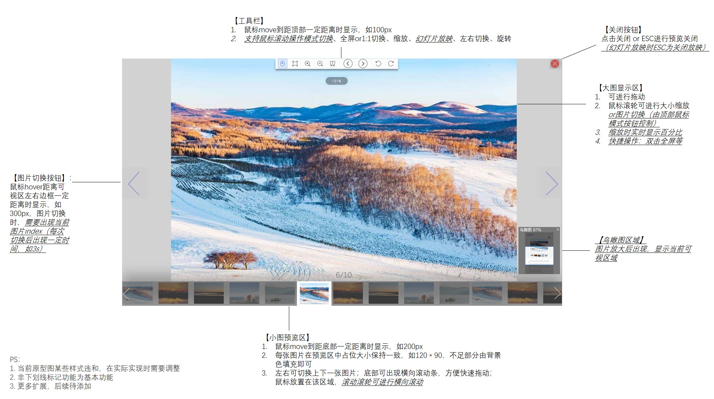

# 组件需求
## 组件输入:
a. 图片数组——图片URL数组，当前需显示图片 
b. dom节点容器，获取容器内所有图片
## 功能需求
1. 图片预览以模态框形式展现，默认显示第一张图，可左右翻页查看图片数组中的其他图片
2. 具有图片小图预览区，可预览当前所有图片，在此区域可进行图片快速切换
3. 图片操作：提供拖拽、缩放、旋转、全屏or1:1切换等基本功能
4. 可进行幻灯片放映
5. 图片放大状态下，可查看当前鸟瞰图
6. 图片切换状态，可显示当前图片index
7. 支持快捷操作：大图区域鼠标滚轮进行缩放、大图区域ctrl+滚轮进行图片切换、方向键切换预览图片、小图预览区鼠标滚轮可进行左右滚动

# 组件设计
## 组件概念图

## 原型图

# 需求拆分与时间线

## 1. 基本功能
### 功能点
+ 组件可接受图片urls输入进行图片预览，默认显示第一张图片
+ 可进行图片切换，点击点击切换按钮进行上下图片切换，切换时底部显示当前图片index
+ 支持鼠标滚轮对图片进行缩放，支持图片拖拽
+ 支持ctrl+鼠标滚轮进行图片切换
### 时间线
+ 3月25日前完成

## 2. 功能完善
### 功能点
+ 支持传入页面节点容器（或通过指令绑定容器），自动获取当前容器下所有图片，并为图片注册点击事件，点击容器下图片即可进行预览
+ 支持工具栏：切换、缩放、旋转
+ 底部图片预览
### 时间线
+ 4月5日前完成

## 3. 功能扩展
### 功能点
+ 幻灯片放映功能
+ 鸟瞰图功能
+ 。。。
### 时间线
+ 4月10日前完成

# 概要设计（模块设计）

# 详细实现

# 测试与DEMO

